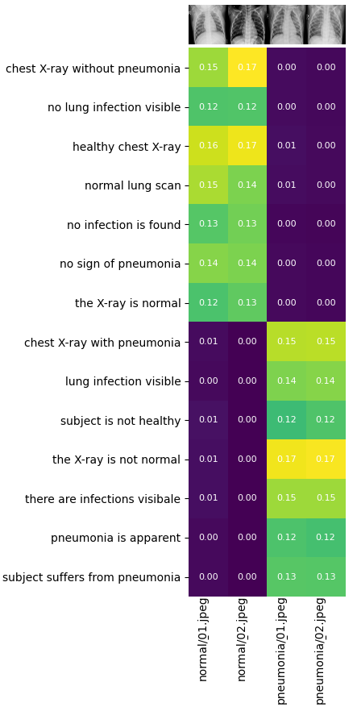

## Hyperparameter Optimization Using Optuna for MNIST Classification

This Jupyter notebook demonstrates fine tuning a CLIP model from OpenAI to be able to detect pneumonia versus normal in chest X-ray scans. Both the vision model and the language model are fine tuned.


## Requirements
- Python 3.10+
- uv
- Jupyter Notebook/Lab
- Required Python packages:
  - numpy
  - matplotlib
  - torch
  - pillow
  - pyqt6
	
## Project Structor
```bash
project_root/
│
├── assets/  
│   ├── normal/
│   │	  ├── 01.jpeg
│   │	  └── 02.jpeg
│   └── pneumonia/   
│ 	    ├── 01.jpeg
│ 	    └── 02.jpeg
├── data/  
│    ├── ...
│ 
├── src/
│   ├── models.py
│   └── utils.py     
├── trainer.ipynb  
├── README.md
└── requirements.txt
```


## Usage
1. Install uv (uv is a fast python package manger):
```bash
pip install uv
```

2. Create a virtul env:

```bash
uv run install -r requirements.txt
```

3. Download the X-ray images from Kaggle website and place it in the data folder:

```bash
https://www.kaggle.com/datasets/paultimothymooney/chest-xray-pneumonia
```
The inside of the data folder should look like this:
```bash
├── data/
│   └── chest_xray/
│       ├── test/  
│       │   ├── normal/
│       │   └── pneumonia/ 
│       ├── train/
│       │   ├── normal/
│       │   └── pneumonia/ 
│       └── val/
│           ├── normal/
│           └── pneumonia/        	
```
4. Run the notebook file trainer.ipynb

## Sample output

<table>
  <tr>
    <td>
      <p> Image and text features similarity </p>
      
</table>